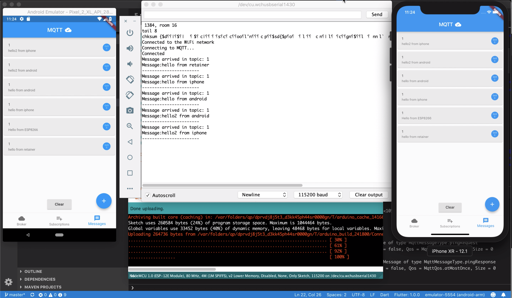

# MQTT Connection Client Sample 
Mobile's App is written by Flutter.
Demonstrates how to use [mqtt_client](https://pub.dartlang.org/packages/mqtt_client) with [Flutter](https://flutter.io/).
<br>
Extends from https://github.com/shamblett/mqtt_client/tree/master/example/flutter

## Getting Started

You can install packages mqtt_client from the command line:
    `$ flutter packages get`
    
## Screenshots


## Video
https://youtu.be/ZDa0UNjTGzw


## 
You can setup a server through [cloundmqtt](https://cloudmqtt.com) or [mosquitto](http://test.mosquitto.org/) for the testing.
By default in code, information environment for testing is:
```dart
    String broker           = 'm15.cloudmqtt.com';
    int    port             = 14375;
    String username         = 'wbpwjaso';
    String passwd           = 'eO-kjpnhyvrI';
    String clientIdentifier = 'lamhx';
```
If it does not work, the service has stopped.

-------
Hope doing well and happy testing!
