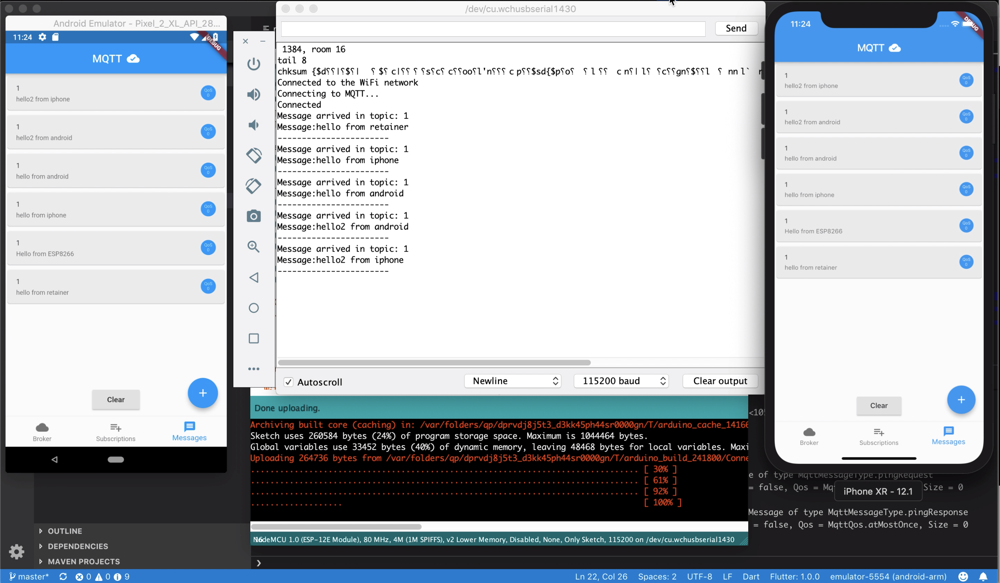

# MQTT Connection Sample 
Mobile's App is written by Flutter.
Demonstrates how to use [mqtt_client](https://pub.dartlang.org/packages/mqtt_client) with [Flutter](https://flutter.io/).
<br>
Extends from https://github.com/shamblett/mqtt_client/tree/master/example/flutter

## Getting Started

Requires Flutter 3.x (Dart 3). Install packages from the command line:
    `$ flutter pub get`
    
## Screenshots


## Video
https://youtu.be/ZDa0UNjTGzw


## 
You can setup a server through [CloudAMQP](https://www.cloudamqp.com) (see the [MQTT docs](https://www.cloudamqp.com/docs/mqtt.html)) or [mosquitto](http://test.mosquitto.org/) for the testing.

CloudAMQP notes:
- The username must carry the vhost: use `vhost:username` (on shared plans the vhost is the same as the username, e.g. `my-user:my-user`).
- Port `8883` is MQTT over TLS, port `1883` is plain MQTT. Only QoS 0 and 1 are supported.

By default in code, information environment for testing is (replace with your own instance's values):
```dart
    String broker           = 'your-instance.lmq.us-east-1.aws.cloudamqp.com';
    int    port             = 8883;
    String username         = 'your-username:your-username';
    String passwd           = 'your-password';
    String clientIdentifier = 'lamhx';
```

-------
Hope doing well and happy testing!
